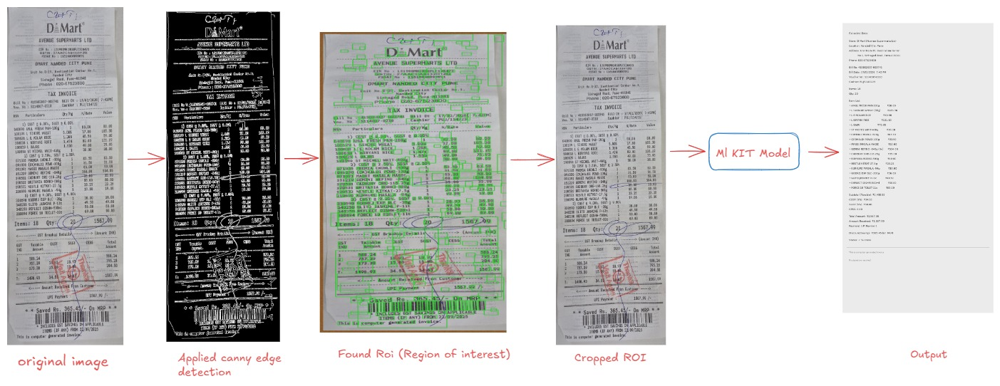
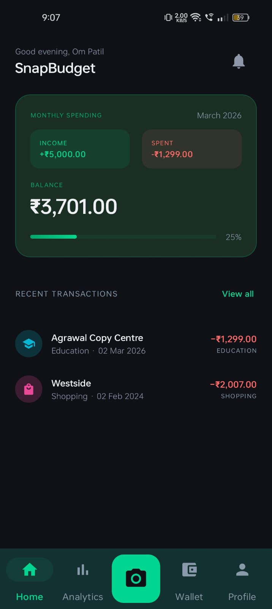
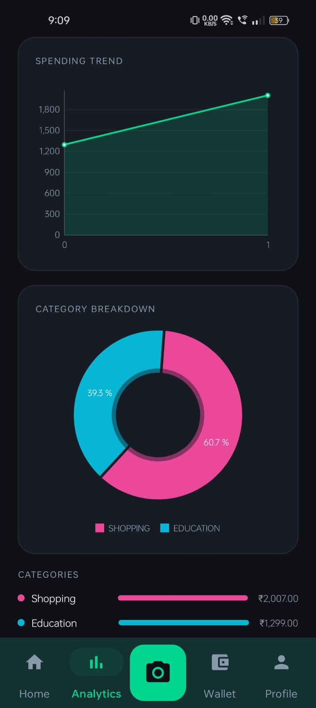
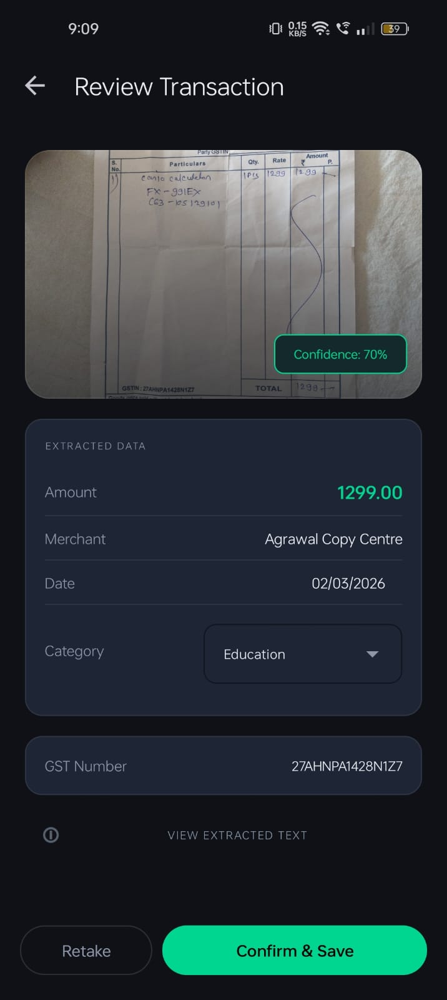
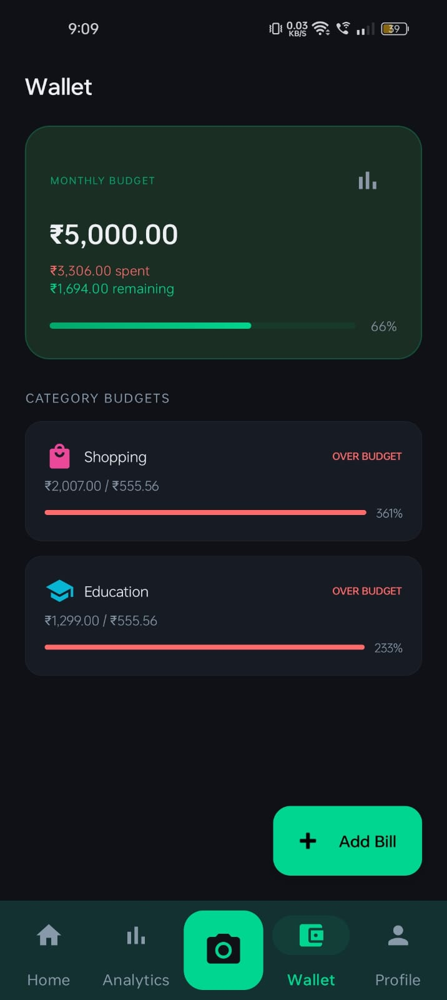

# SnapBudget

> **Snap. Extract. Save. Zero typing required.**

An intelligent Android expense tracker that scans receipts using OCR and automatically categorizes your expenses — transforming a 10-minute chore into a 2-second habit.


-blue?style=flat-square)


---

## Digitization Pipeline



---

## App Preview

<p align="center">
  
   
   
   
  
   
  
</p>

---

## Features


Capture via camera or upload from gallery using Google ML Kit on-device OCR.


Auto-detects merchant name, total amount (₹), date, GST number, and line items.


Classifies expenses into Food, Travel, Shopping, Utilities, Health, and more.


Field-level reliability scores with cross-validation and OCR error correction.


Fully functional without internet; all data stored locally via Room (SQLite).


Monthly totals, category-wise breakdown, and interactive pie chart visualizations.

---

## Key Metrics

| Metric | Value | Notes |
|---|---|---|
| Processing Speed | **< 2 seconds** | Time to process receipts and transactions |
| Extraction Accuracy | **> 95%** | Data extraction and categorization accuracy |
| Offline Capability | **90%** | Tasks performed without internet connection |
| Weekly Time Saved | **15–20 min/user** | Per user, weekly |
| Server Cost | **₹0** | Local-first architecture |

---

## Tech Stack

| Layer | Technology |
|---|---|
|  | Kotlin |
|  | Model-View-ViewModel |
|  | Google ML Kit Text Recognition |
|  | Jetpack CameraX |
|  | Room (SQLite) |
|  | MPAndroidChart |
|  | Material Design 3 |

---

## Getting Started

### Prerequisites


```bash
git clone https://github.com/your-username/snapbudget-ocr
# Open in Android Studio → Sync Gradle → Run on device or emulator (API 24+)
```

**Required permissions:** `CAMERA` · `READ_MEDIA_IMAGES` 

---

